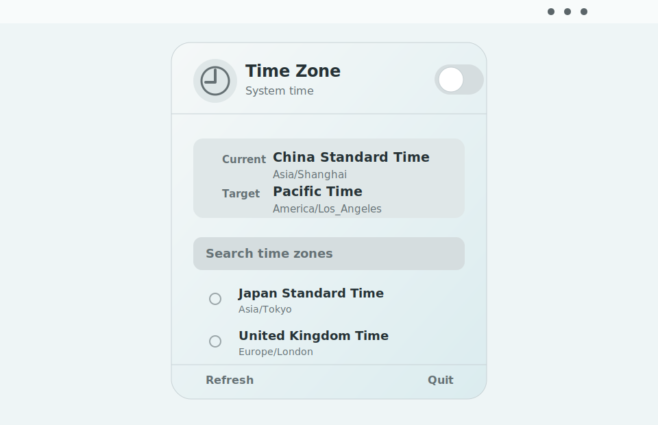

# 时区切换器

[](https://github.com/daxiangme/time-zone-switcher/actions/workflows/ci.yml)
[](https://github.com/daxiangme/time-zone-switcher/releases/latest)
[](LICENSE)


[English](README.md)

一个 macOS 菜单栏小工具，用于临时切换系统时区，并在需要时恢复到之前记录的时区。

当你需要测试日历、排期、订阅、国际化、区域相关逻辑时，可以用它快速切换时区，而不需要永久改变自己的日常系统设置。

[下载最新版本](https://github.com/daxiangme/time-zone-switcher/releases/latest)



## 为什么需要它

开发者、测试工程师、产品构建者和支持团队经常需要确认这些问题：

- 日历事件在太平洋时间下是否正确显示？
- 一个定时任务跨过其他地区的午夜时是否表现正常？
- 订阅、账期、日期边界在非本地时区是否正确？
- 能否复现只在某个时区出现的用户问题？

时区切换器把这个流程放到菜单栏里，并且可以随时恢复。

## 功能

- 只常驻菜单栏，不显示 Dock 图标。
- 支持搜索和选择任意 IANA 时区，例如 `America/Los_Angeles`、`Europe/London`、`Asia/Tokyo`。
- 时区名称跟随系统语言本地化显示，同时保留 IANA 标识，避免歧义。
- 打开开关时，记录当前系统时区，然后切换到所选目标时区。
- 关闭开关时，恢复到之前记录的系统时区。
- 使用原生 SwiftUI 控件和 macOS 材质风格。

## 隐私与安全

- 不收集分析数据。
- 不发送网络请求。
- 不做后台轮询。
- 只会在你打开或关闭时区切换开关时请求管理员权限。
- 底层使用的系统命令是：

```bash
systemsetup -settimezone <IANA 时区标识>
```

## 安装

从最新 Release 下载压缩包，解压后把 `Time Zone Switcher.app` 拖到 `/Applications`。

当前发布包是开源项目常见的 unsigned、未 notarized 构建。首次打开时，macOS 可能会因为它来自互联网而阻止启动。可以这样打开：

1. 打开 **系统设置**。
2. 进入 **隐私与安全性**。
3. 找到被阻止的 App 提示，选择 **仍要打开**。

也可以按住 Control 点击 App，然后选择 **打开**。

## 从源码构建

环境要求：

- macOS 26+
- Xcode 26+
- Swift 6.3+

构建 App：

```bash
Scripts/build_app.sh
```

运行：

```bash
open "dist/Time Zone Switcher.app"
```

生成发布压缩包：

```bash
Scripts/package_release.sh
```

## 路线图

- 常用时区收藏。
- 菜单栏紧凑状态显示。
- 快捷键。
- 可选 DMG 打包。
- 可选 notarized 构建。
- 更多语言本地化。

## 参与贡献

欢迎参与贡献。查看 [CONTRIBUTING.md](CONTRIBUTING.md)。

## 许可证

MIT
